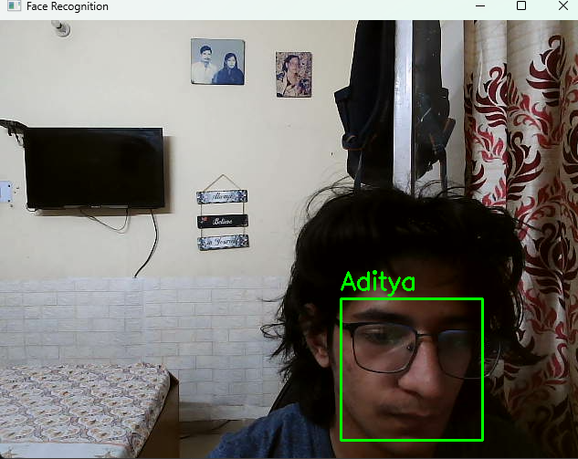

# 🎯 CodSoft Internship - Task 5  
## 👁️ Face Recognition System (Python + OpenCV)

### 📘 Overview
This project is part of my **CodSoft Internship**.  
The objective of this task is to create a **Face Recognition System** using the `face_recognition` and `OpenCV` libraries in Python.  
It detects faces through a live webcam feed, matches them with known images, and displays the recognized person's name in real time.

---

### ⚙️ Features
- Detects and recognizes faces in real-time using your webcam.  
- Automatically matches detected faces with saved images.  
- Displays the recognized person’s name on the video stream.  
- Supports multiple known faces stored in a folder.  
- Option to quit instantly by pressing the **‘q’** key.

---

### 🧠 Technologies Used
- **Python 3.12**
- **OpenCV** (`cv2`)
- **face_recognition**
- **NumPy**
- **dlib** (used in face recognition)

## Reference Used:
This Project was developed based on the following video 
- [FACE RECOGNITION + ATTENDANCE PROJECT | OpenCV Python | Computer Vision](https://youtu.be/sz25xxF_AVE?si=c_J6rrWmVNCg_CXq) 
---

### 📁 Project Structure
- 📂 face models # Folder containing known faces (e.g., Aditya.jpg)
- 📜 face_recog.py # Main Python script
- 📂 pycache # (auto-generated, ignored)
- 📜 README.md # Project documentation

### 🚀 How to Run
1. **Install Dependencies**
   ```bash
   py -m pip install numpy opencv-python face_recognition
2. Add Known Faces
   Place clear images of known people inside the folder:
   Example:
   Aditya.jpg

3. Run the Script
   py face_recog.py

4. Usage 
The webcam window will open.

If a face matches a known image, their name will appear.

Press ‘q’ to quit.

## Example Output:
When the webcam detects a known face:

✅ Recognized: Aditya
If unknown:

❌ Unknown


